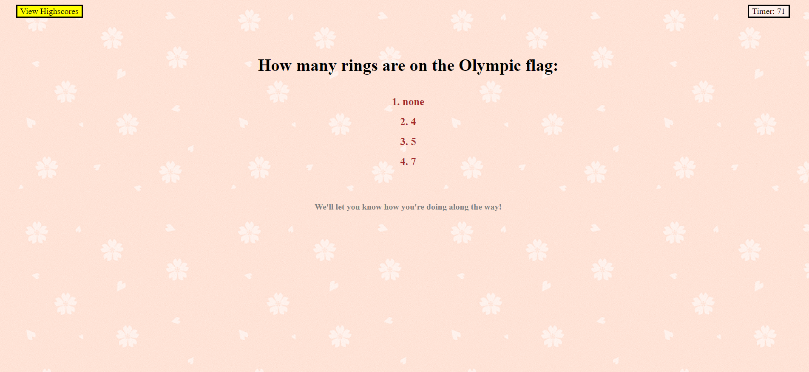

# Portfolio
This page will allow the user to store information about their daily to-dos. The user may type what they would like to do in the "To Do" section of each timeblock. If the user clicks the save button on the right, the information will get stored and reappear on the screen should it refresh. If they user enters something different into a To Do box and presses the save button again, the information will update and contain the most current info saved. The differing colors of the To Do slots indicate past, present, and future.

## Deployment Link
https://kkwoka.github.io/KK_Portfolio

## Included Files
* index.html
* portfolio.html
* contact.html
* README.md
* Assets/
    * Assets/css
        * reset.css
        * style.css
    * Assets/Images
        * CodeQuiz.png
        * contact4.png
        * linkd.jpg
        * paisley.png
        * PassGen.png
        * password-big.png
        * planner.png
        * quiz2.png
        * Scheduler.png
        * smorgas-chord.png
        * SmorgasShot.png
        * weather.jpg
        * WeatherDash.png
        * Portfolio.png
        * AboutMe.png
        * Contact.png

## Resources
* Bootstrap
* JQuery

## Images of Working Password Generator

